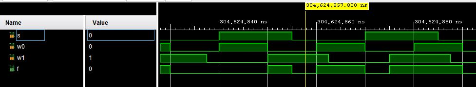

# Simple example of learning VHDL:
---
The VHDL language consists of two parts:
 
entity and architecture
 
 
**Entity**:\
In thr entity part, the input and output signals of the circuit are defined, which establish its connection with the external environment.
For each input or output signal, the name, direction (input, output, or bidirectional), and type are specified.
It does not give us information about the function or internal structure of the design and is simply a black box with specific inputs/outputs defined.

**Architecture**:\
In this section, the function and/or internal structure of the circuit is defined.

An example of this explanation is given in the multiplexer example.

After simulation in Vivado software, the resulting waveform is as follows:
 

