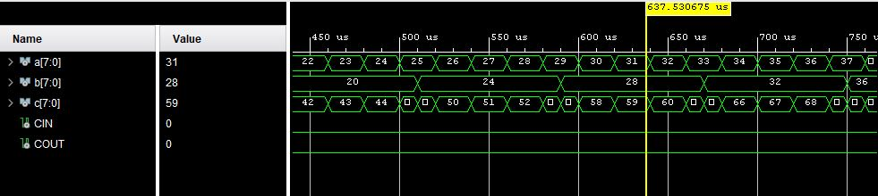

# VHDL learning examples:
---
# Start
- This section contains a list of examples given in the first chapter.

<details>
<summary> List of examples </summary>
<ul>
    <li> <a href = "#h1"> 1.mux21 </a> </li>
    <li> <a href = "#h2"> 2.halfadder_delay </a> </li>
    <li> <a href = "#h3"> 3.full_adder </a> </li>
    <li> <a href = "#h4"> 4.MUX41_when </a> </li>
    <li> <a href = "#h5"> 5.Compare_8Bit </a> </li>
    <li> <a href = "#h6"> 6.Multiplier_8bit_signed </a> </li>
    <li> <a href = "#h7"> 7.Adder_8bit_unsigned </a> </li>
    <li> <a href = "#h8"> 8.BCD7Seg </a> </li>
    <li> <a href = "#h9"> 9.NANDGate_testbench </a> </li>
    <li> <a href = "#h10"> 10.Adder_8bit_test </a> </li>
    <li> <a href = "#h11"> 11.Adder_4bit_structural </a> </li>
    <li> <a href = "#h12"> 12.two_architecture </a> </li>
    <li> <a href = "#h13"> 13.ADN2_diff_delay </a> </li>
    <li> <a href = "#h14"> 14.Multiplier_nbit </a> </li>
    <li> <a href = "#h15"> Further examples </a> </li>
</ul>
</details>

<h1 id = 'h1'> 1.mux21 </h1>
The VHDL language consists of two parts:
<br />
entity and architecture
<br />
<br />

<span style="color:blue">**Entity**:</span>

- In thr entity part, the input and output signals of the circuit are defined, which establish its connection with the external environment.
For each input or output signal, the name, direction (input, output, or bidirectional), and type are specified.
It does not give us information about the function or internal structure of the design and is simply a black box with specific inputs/outputs defined.

<span style="color:blue">**Architecture**:</span>

In this section, the function and/or internal structure of the circuit is defined.
An example of this explanation is given in the multiplexer example.
After simulation in Vivado software, the resulting waveform is as follows:
<br>


---
<h1 id = 'h2'> 2.halfadder_delay </h1>

- The mechanism for delaying the assignment of a new value to the left-hand signal in assignment statements is called <span style="color:blue">_**timing**_</span>. This is done using the <span style="color:blue">_**after**_</span>. keyword. This feature makes circuit simulation closer to reality, although it is ignored in circuit synthesis and has no effect on the final circuit.

After simulation in Vivado software, the resulting waveform is as follows:
<br>


- As shown in the results figure, the sum is transferred to the output signal <span style="color:blue">_**s**_</span> after 10 nanoseconds and to the output signal <span style="color:blue">_**c**_</span> after 5 nanoseconds.
---
<h1 id = 'h3'> 3.full_adder </h1>

- A signal can have different types. In VHDL, to overcome the limitation of the limited number of values ​​and to allow other values ​​such as high impedance and undefined value to be represented, another type called <span style="color:blue">_**STD_LOGIC**_</span> has been defined. Signals defined as this type can represent 9 different values.

After simulation in Vivado software, the resulting waveform is as follows:
<br>


---
<h1 id = 'h4'> 4.MUX41_when </h1>

- The format of the conditional signal assignment command is as follows:
```
Target_signal <= expression WHEN Boolean_condition ELSE
		    expression WHEN Boolean_condition ELSE
		    …
		    expression;
```

- The <span style="color:blue">_**Target_signal**_</span> signal receives the value of the first expression whose condition is true, and if no condition is true, it receives the value of the last expression without the specified condition. If multiple conditions are true, the value of the expression corresponding to the first true condition is assigned.
- In this code, the state of the selection inputs, <span style="color:blue">_**S0**_</span> and <span style="color:blue">_**S1**_</span> , is checked as a combination of two comparison expressions using the and operator. This example shows that logical operators such as and, or, etc. can also be used to combine Boolean comparison expressions. Any Boolean expression can be used instead of a condition in a when-else statement or any other conditional statement.

After simulation in Vivado software, the resulting waveform is as follows:
<br>


---

<h1 id = 'h5'> 5.Compare_8Bit </h1>

- To define a multi-bit signal, vector types must be used. These types include <span style="color:blue">_**bit_vector, std_ulogic_vector, and std_logic_vector**_</span>.

- In VHDL, in addition to logical operators, arithmetic operators (+, -, *, /, mod, rem, **, and abs) are defined for addition, subtraction, multiplication, division, unsigned remainder, signed remainder, exponent, and absolute value operations, respectively. 
- In addition, comparison operators (=, /=, <=, >, >=) are also defined for equality, inequality, less than, less than equal, greater than, and greater than equal, respectively. Since we often use std_logic_vector to model multi-bit signals, it is necessary to use one of the <span style="color:blue">_**std_logic_unsigned**_</span> or <span style="color:blue">_** std_logic_signed**_</span> packages in addition to the <span style="color:blue">_**std_logic_1164**_</span>  package to perform arithmetic and comparison operations on them. The first package is used for unsigned calculations, and the second package is used for signed calculations.

After simulation in Vivado software, the resulting waveform is as follows:
<br>


---

<h1 id = 'h6'> 6.Multiplier_8bit_signed </h1>

- Whether numbers are signed or not is important in multiplication, division, and comparison operations.
In multiplication, the length of the product is always equal to the sum of the lengths of the two input numbers.

After simulation in Vivado software, the resulting waveform is as follows:
<br>


---

<h1 id = 'h7'> 7.Adder_8bit_unsigned </h1>

- In this example, you see the description of an 8-bit unsigned adder that also has a carry input and an output. In this description, a 9-bit internal signal called <span style="color:blue">_**INTSUM**_</span>  is defined. First, the sum is placed in it. Then the lower 8 bits are transferred to the SUM output and the ninth bit is transferred to the <span style="color:blue">_**COUT**_</span>  output.
- In the first assignment statement, all three inputs are expanded to 9 bits using the concatenation operator (&) by appending a number of zeros. Then, the addition operation is performed on them.

After simulation in Vivado software, the resulting waveform is as follows:
<br>


---

<h1 id = 'h8'> 8.BCD7Seg </h1>

- The general format of the selected signal assignment command is as follows:
``` VHDL
with choice_expression select
	target <= expression when choices,
	target <= expression when choices,
	…
	target <= expression when choices,
	target <= expression when others;
```
- <span style="color:blue">_**target**_</span>  is a signal that receives one of the values ​​of <span style="color:blue">_**expression**_</span>  depending on which of the choices the <span style="color:blue">_**choice_expression**_</span>  is equal to. The first choice that is equal is the criterion.

 After simulation in Vivado software, the resulting waveform is as follows:
<br>


---

<h1 id = 'h9'> 9.NANDGate_testbench </h1>

- After describing each design in VHDL, it is necessary to simulate it to evaluate and ensure the correct operation of the design. Simulation is done to test the design. To test a design, you must give it inputs and observe and examine its outputs.
- A test program is actually a VHDL code consisting of an <span style="color:blue">_**Entity**_</span>   and an <span style="color:blue">_**Architecture**_</span>. The Entity part has no inputs or outputs. In the Architecture definitions, the signals by which the waveform is to be applied to the design are defined. In the Architecture body, an instance of the design is first created and the desired internal signals are connected to them. Then the input waveforms are created and applied to the corresponding signals.
- In this example, the word <span style="color:blue">_**Now**_</span>    refers to the current time of the simulation. The initial values ​​of both signals <span style="color:blue">_**aa**_</span>  and <span style="color:blue">_**bb**_</span>  are given as zero. The first assignment statement inverts the value of aa from 0 to 1000 microseconds at 20 microsecond intervals. The same operation is performed in the second assignment statement for signal bb, except that the change intervals are 50 microseconds.

``` VHDL
aa <= NOT aa AFTER 20 us WHEN NOW <= 1000 us ELSE ‘0’;
bb <= NOT aa AFTER 50 us WHEN NOW <= 1000 us ELSE ‘0’;
```

After simulation in Vivado software, the resulting waveform is as follows:
<br>


---

<h1 id = 'h10'> 10.Adder_8bit_test </h1>

- In this example, while the initial value of the two inputs to the adder is zero, their values ​​increase at intervals of 20 and 50 microseconds between zero and 1000 microseconds. In this way, the adder is tested with different numbers.

``` VHDL
a <= a+1 AFTER 20 us WHEN NOW <= 1000 us ELSE ‘00000000’;
b <= b+1 AFTER 50 us WHEN NOW <= 1000 us ELSE ‘00000000’;
```
After simulation in Vivado software, the resulting waveform is as follows:
<br>


---

<h1 id = 'h11'> 11.Adder_4bit_structural </h1>

- Structural modeling allows for hierarchical design, such that each entity being described can be used as a component in describing another entity. The hierarchical design method is often used in designs that can be expanded through iteration.

After simulation in Vivado software, the resulting waveform is as follows:
<br>


---

<h1 id = 'h12'> 12.two_architecture </h1>

- More than one Architecture with different names can be defined for an Entity.

-  After simulation in Vivado software, the resulting waveform is as follows:
<br>


---

<h1 id = 'h13'> 13.ADN2_diff_delay </h1>

- Using the <span style="color:blue">_**Generic**_</span>   command, a circuit can be defined parametrically and then the values ​​of the parameters can be specified when creating the instance. Time delays, data bus width and signal width, dimensions and number of components forming the circuit are some of the things that can be defined parametrically using the  <span style="color:blue">_**Generic**_</span> command.
- In this example, an AND gate is defined using the Generic statement with three parameters: <span style="color:blue">_**rise**_</span> , <span style="color:blue">_**fall**_</span> , and <span style="color:blue">_**load**_</span> . In the Architecture section, these parameters are used to specify the rise and fall delays.

After simulation in Vivado software, the resulting waveform is as follows:
<br>


---

<h1 id = 'h14'> 14.Multiplier_nbit </h1>

- One of the capabilities of the <span style="color:blue">_**Generic**_</span>  command is to define the circuit dimensions parametrically. For example, you can design an n-bit multiplier and set the value of n to an arbitrary number when using it, depending on your needs.

After simulation in Vivado software, the resulting waveform is as follows:
<br>


---

<h1 id = 'h15'> Further examples </h1>

- Further examples are given in the second chapter.

# End of the first season


